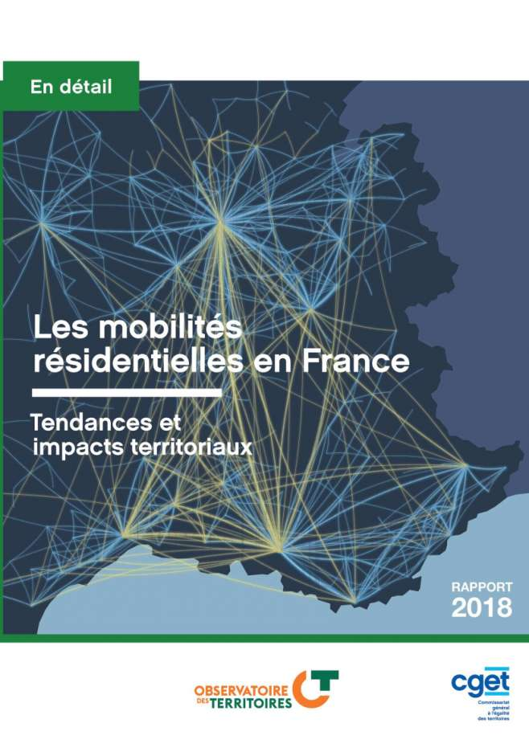
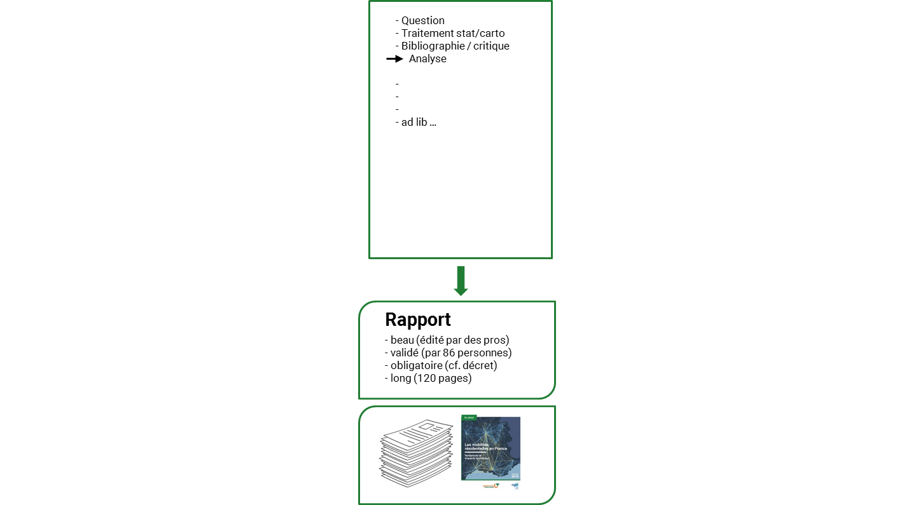
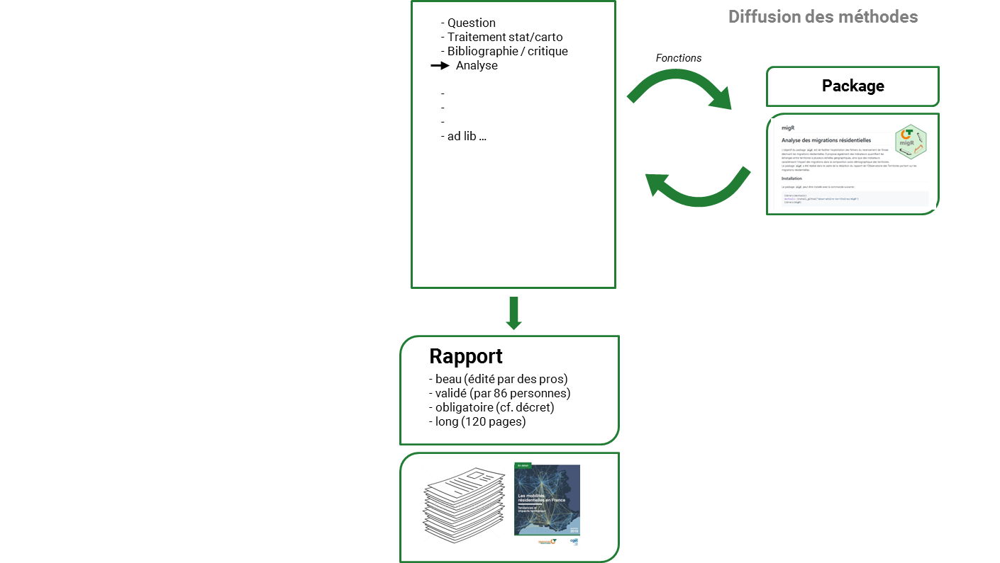
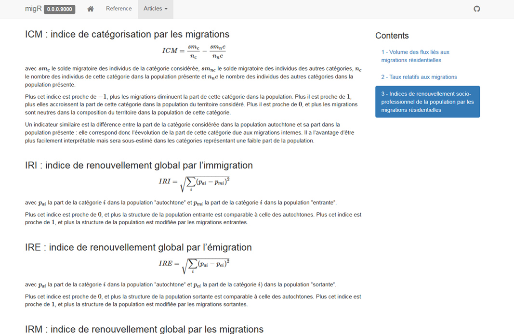
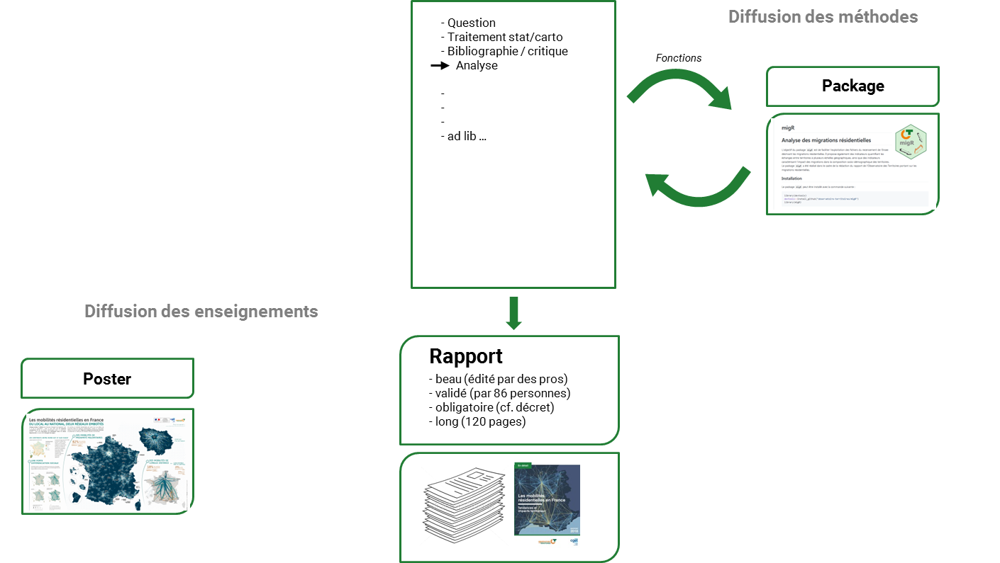
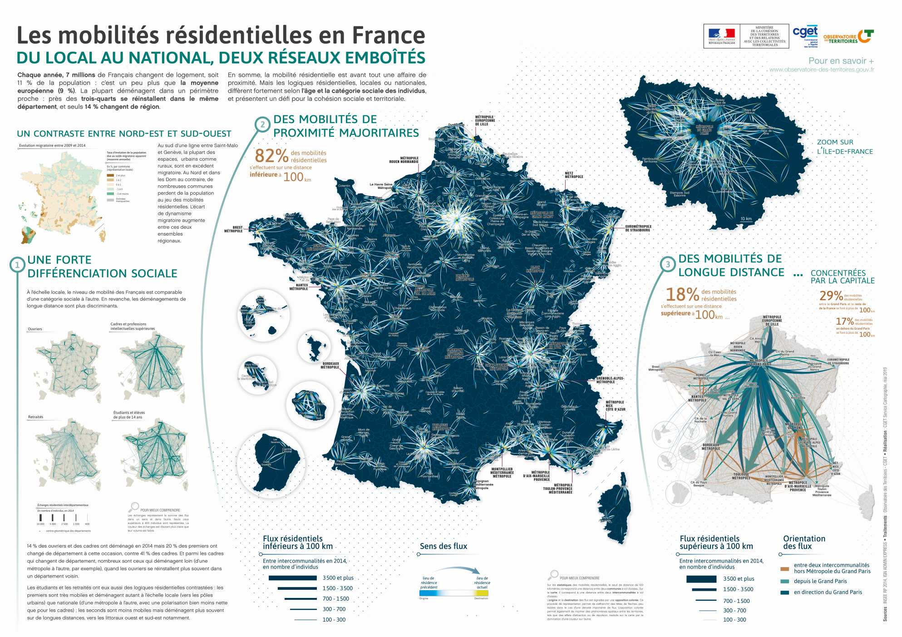
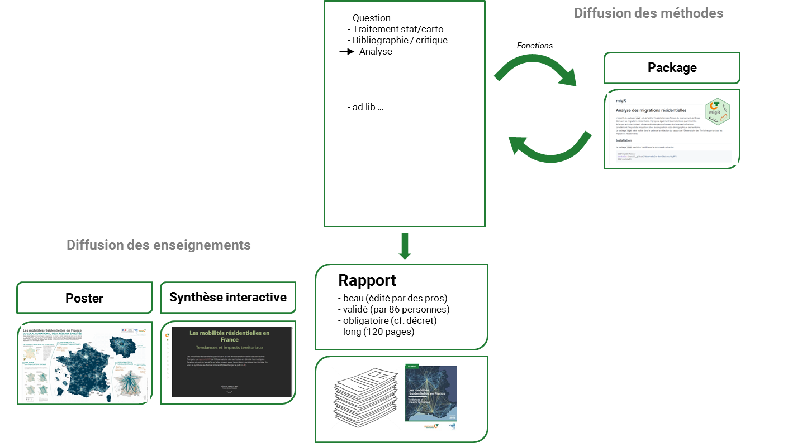
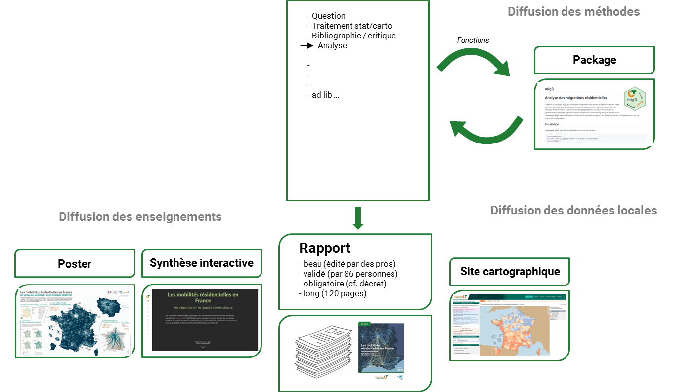
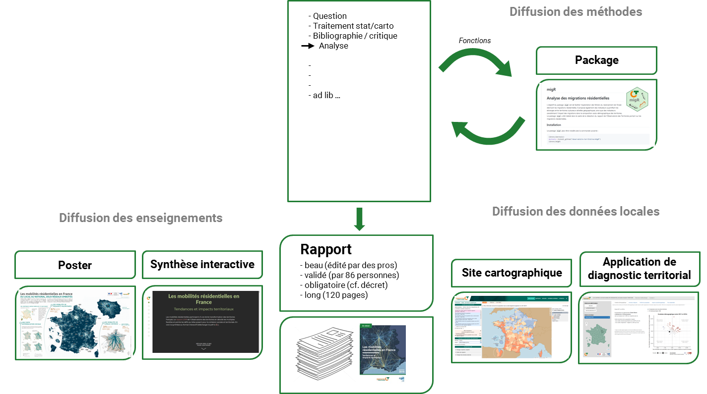

```{r setup, include=FALSE}
options(htmltools.dir.version = FALSE)


library(knitr)    # For knitting document and include_graphics function
library(ggplot2)  # For plotting
library(png)      # For grabbing the dimensions of png files
library(grid)

```


# L'Observatoire des territoires  
  
<br>


+ ### Créé par décret en 2004, renouvelé en 2011 puis en 2017 (pour 6 ans)

Placé auprès du ministre chargé de l’aménagement du territoire.

Un conseil d’orientation présidé par une personnalité qualifiée.

Le secrétariat permanent de l’Observatoire est assuré par le CGET 

***

+ ### Ses missions

Rassembler, analyser et diffuser des données sur les dynamiques et les disparités territoriales, en articulant les échelles (rapports, fiches analyse, site).

Développer des méthodes innovantes pour l’analyse des territoires

***

+ ### Les rapports de l’Observatoire des territoires

Des [analyses](https://www.observatoire-des-territoires.gouv.fr/observatoire-des-territoires/fr/node) approfondies pour guider les acteurs publics dans l’élaboration de diagnostics locaux.

Des indicateurs statistiques et des cartes disponibles [en ligne](https://www.observatoire-des-territoires.gouv.fr/outils/cartographie-interactive/#c=home)

---


# Le rapport sur les mobilités résidentielles 
  
<br>


+ ### Les français sont-ils moins mobiles que les européens ? Moins mobiles qu'avant ?
+ ### Qui déménage plus ?
+ ### Vers quels territoires se déplacent-ils préférentiellement ?
+ ### Qui va où ? A quel âge ?
+ ### Quel impact sur le profil socio-démographique des territoires ?
+ ### Quels liens entre mobilités et emploi ?
--


.pull-left[
Tout ce que vous avez toujours voulu savoir sur __les mobilités__ sans jamais oser le demander `r icon::fa("arrow-alt-circle-right")`  


]
.pull-right[

<a href="https://www.observatoire-des-territoires.gouv.fr/observatoire-des-territoires/fr/rapports"> 
]

---

# Analyser / écrire / diffuser



???
travail en binome avec Louise Haran, collègue géographe


---
# Analyser / écrire / diffuser


???
premier package : pas beau
open source : tomber sur un bon sammaritain qui améliore / corrige

---

# Un package pour ...
##  S'obliger à documenter les concepts, les méthodes


- solde migratoire apparent $\neq$ solde migratoire net interne.
- Population entrante / sortante/ stable / autochtone ...
- Indices de renouvellement socio-démographique

<a href="https://observatoire-territoires.github.io/migR/articles/methodo_migr.html"> 

-> [https://observatoire-territoires.github.io/migR/articles/methodo_migr.html](https://observatoire-territoires.github.io/migR/articles/methodo_migr.html)   _© Joël Gombin_

???
reprise des travaux de Joel Gombin

---

# Un package pour ...
##  Charger / formater des tables de détail décrivant des migrations


Télécharger le fichier détail des migrations résidentielles du recensement de l’Insee :
```{r eval=FALSE, tidy=FALSE}
library(migR)
FD_MIGCOM_2016 <- chargement_fd_migcom(telechargement = TRUE,
                                       anneeRP = "2016",
                                       monet = TRUE,
                                       dossier_dest_TL = "./data")

```

Ajouter des maillages supracommunaux à la table de détail :
```{r eval=FALSE, tidy=FALSE}
library(migR)
FD_MIGCOM_2016  <-  
  ajout_nivgeo_supracomm(TABLE = FD_MIGCOM_2016 ,
                         CODE_COMMUNE = "DCRAN",
                         SUFFIXE = "ANTE",
                         NIVGEO= c("DEP","REG",'EPCI','TYPEDENS'),
                         COG_IN = 2018,
                         COG_NIVGEO = 2019) 

```

-> [https://observatoire-territoires.github.io/migR/articles/tutorial_fonctions_migr.html](https://observatoire-territoires.github.io/migR/articles/tutorial_fonctions_migr.html)

???
sujet des migrations pas aisé, notamment à cause de la lourdeur des tables

---

# Un package pour ...
##  Calculer des flux et des indicateurs sur les migrations


Calculer des flux de mobilités résidentielles entre territoires :
```{r eval=FALSE, tidy=FALSE}
library(migR)
flux_migres_DEP <-
calcul_flux_migres(TABLE =FD_MIGCOM_2016 ,
                 VAR_NB = "IPONDI",
                 MIG_NET_INTERNE=TRUE,
                 NIVGEO_ANTE ="DEP_ANTE",
                 NIVGEO_ACTU ="DEP_ACTU")

```

Calculer des indicateurs synthétiques liés aux mobilités résidentielles :
```{r eval=FALSE, tidy=FALSE}
library(migR)
indics_migres_DEP <-
  calcul_indics_migres(TABLE =flux_migres_DEP,
                       NIVGEO_ANTE ="DEP_ANTE",
                       NIVGEO_ACTU ="DEP_ACTU",
                       VAR_NB = "nb_ind",
                       NIVGEO ="DEP") 

```

-> [https://observatoire-territoires.github.io/migR/articles/tutorial_fonctions_migr.html](https://observatoire-territoires.github.io/migR/articles/tutorial_fonctions_migr.html#calculer-des-indicateurs-synthetiques-lies-aux-mobilites-residentielles)

???

+ indicateurs de renouvellement socio-démographique


---

# Un package pour ...
## Se faciliter la vie

Ajouter un champ contenant le libellé d’un territoire à partir de son code court :
```{r eval=FALSE, tidy=FALSE}
library(migR)
indics_migres_DEP <-
ajout_libelles_nivgeo(TABLE = indics_migres_DEP,
                      NIVGEO_IN ="DEP",
                      COG_NIVGEO = 2019)

```

Ajouter un champ contenant le libellé d’une variable de ventilation (sexe, groupe socioprofessionnel, secteur d’activité…) à partir de son code court :
```{r eval=FALSE, tidy=FALSE}
library(migR)
indics_migres_DEP_CS1 <-
ajout_libelles_varventil_insee(TABLE = indics_migres_DEP_CS1,
                               VAR ="CS1",
                               MILLESIME_RP = 2016)

```

-> [https://observatoire-territoires.github.io/migR/articles/tutorial_fonctions_migr.html](https://observatoire-territoires.github.io/migR/articles/tutorial_fonctions_migr.html#faciliter-la-lecture-des-tableaux-de-flux-et-dindicateurs)


???

S’appuie sur package COGugaison de Kim Antunez

•  Répliquer un traitement sur une autre maille géographique
•  Répliquer un traitement sur une autre période
•  Actualiser une analyse avec les données actualisées/corrigées du producteur
•  Gagner un temps fou

tout n'est pas documenté / réplicable, seuls les traitements les plus lourds et répétitifs
données sensibles sur CASD

---
# Analyser / écrire / diffuser


---

# Un poster pour ...

+ ### Mettre en valeur les flux
+ ### Offrir une entrée très visuelle dans le sujet
+ ### Rester visible IRL

<!-- {height=400px} -->

```{r  echo=FALSE, out.height = "60%",out.width = "55%", fig.align="center"}
poster <- "img/visuels_rapports/poster_mobres_v1.png"
include_graphics(poster) 
```

-> [https://cartotheque.cget.gouv.fr](https://cartotheque.cget.gouv.fr/media/record/eyJpIjoiZGVmYXVsdCIsIm0iOm51bGwsImQiOjEsInIiOjMzMjZ9/)                   _© Hassen Chougar - CGET_


???
flux courtes distance 
synthèse des différentes méthodes de représentation inspirées des travaux de F. Bahoken et
Anita Graser


---
# Analyser / écrire / diffuser


---

# Une synthèse interactive pour ...

+ ### Offrir une alternative à la lecture du pavé
+ ### Synthétiser les principaux enseignements
+ ### S'adapter à un format web type scrolly-telling
<!--  -->

<!-- <video width="320" height="240"> -->
<!-- <source src="img/visuels_rapports/anim_synthese_interactive.mp4" type="video/mp4"> -->
<!-- </video> -->

<iframe width="800" height="400" src="img/visuels_rapports/anim_synthese_interactive_v2.mp4" frameborder="0" allowfullscreen></iframe>

<!-- <iframe width="1200" height="400" src="https://observatoire-territoires.github.io/synthese_mob_resid/" frameborder="0" allowfullscreen></iframe> -->

-> [https://observatoire-territoires.github.io/synthese_mob_resid/](https://observatoire-territoires.github.io/synthese_mob_resid/)                    _© Bertrand Miroux - CGET_

???
html/javascript
lisibilité sur mobile, responsive
1er test
à mieux intégrer dans le site , hébergement sur github


---
# Analyser / écrire / diffuser


---

# Un site de cartographie statistique pour ...

+ ### Afficher des indicateurs à n'importe quelle échelle
+ ### Croiser les informations stats sur des thématiques variées
+ ### Dresser le portrait de son territoire, le comparer avec d'autres

```{r  echo=FALSE, out.height = "60%",out.width = "60%", fig.align="center"}
poster <- "img/visuels_rapports/ecran_geoclip.png"
include_graphics(poster) 
```

-> [https://www.observatoire-des-territoires.gouv.fr/outils/cartographie-interactive](https://www.observatoire-des-territoires.gouv.fr/outils/cartographie-interactive/#bbox=275649,6428761,974101,690658&c=indicator&f=3&i=indics_migres_csp.tm_pr_1000_csp&s=2016&view=map9)                  


???
outil central de l'OT
problème : mauvais pour cartographier flux, ne permet pas un diagnostic spécifique sur
les migrations

---
# Analyser / écrire / diffuser


???
interet : process d'actualisation package + appli

---

# Une appli dédiée au diagnostic territorial des mobilités pour ...

+ ### Proposer une vision d'ensemble des indicateurs sur son territoire
+ ### Décliner les enseignements du rapport au niveau local
+ ### Elargir la palette des visualisations possibles

```{r  echo=FALSE, out.height = "50%",out.width = "50%", fig.align="center"}
poster <- "img/visuels_rapports/ecran_app_mobres.png"
include_graphics(poster) 
```

-> [http://outils.observatoire-des-territoires.gouv.fr/mob_resid/](http://outils.observatoire-des-territoires.gouv.fr/mob_resid/)                  

???
techho : r shiny pour réutiliser une partie des visuels conçus en statique, gagner du
temps pour prototyper
pas aussi souple et responsive que du dev js


---
class:top 
<br>
<br>
<br>
<br>

# Nous contacter


.pull-right[

<a href="mailto:observatoire@cget.gouv.fr">
.white[`r icon::fa("paper-plane")` observatoire@cget.gouv.fr]
</a>

<a href="http:/observatoire-territoires.github.io/sageo2019">
.white[`r icon::fa("link")` observatoire-territoires.github.io/sageo2019]
</a>


<a href="http://github.com/observatoire-territoires">
.white[`r icon::fa("github")` @observatoire-territoires]
</a>


]
